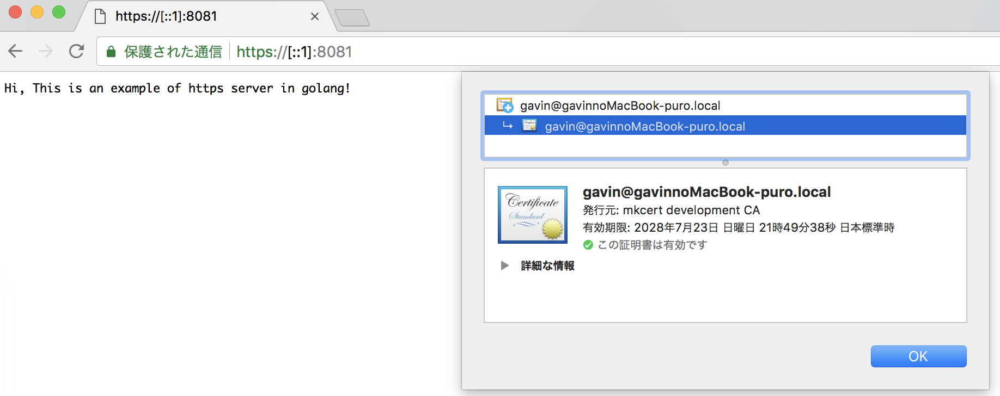

# Hello LocalHttps

##  Install mkcert

On macOS, use Homebrew.

```bash
brew install mkcert
brew install nss # if you use Firefox
```

build from source (requires Go 1.10+)

```bash
go get -u github.com/FiloSottile/mkcert
$(go env GOPATH)/bin/mkcert
```

mkcert is a simple tool for making locally-trusted development certificates. It requires no configuration.

```bash
$ mkcert -install
Created a new local CA at "/Users/filippo/Library/Application Support/mkcert" 💥
The local CA is now installed in the system trust store! ⚡️
The local CA is now installed in the Firefox trust store (requires restart)! 🦊

$ mkcert dev.test.local localhost 127.0.0.1 ::1
Using the local CA at "/Users/filippo/Library/Application Support/mkcert" ✨

Created a new certificate valid for the following names 📜
 - "dev.test.local"
 - "localhost"
 - "127.0.0.1"
 - "::1"
```

## Test go with https server on localhost

```go
	err := http.ListenAndServeTLS(":8081", "dev.test.local+3.pem", "dev.test.local+3-key.pem", nil)
	if err != nil {
		log.Fatal("ListenAndServe: ", err)
	}
```

```go 
go run https-server.go
```

## Open LocalHttps on chrome

